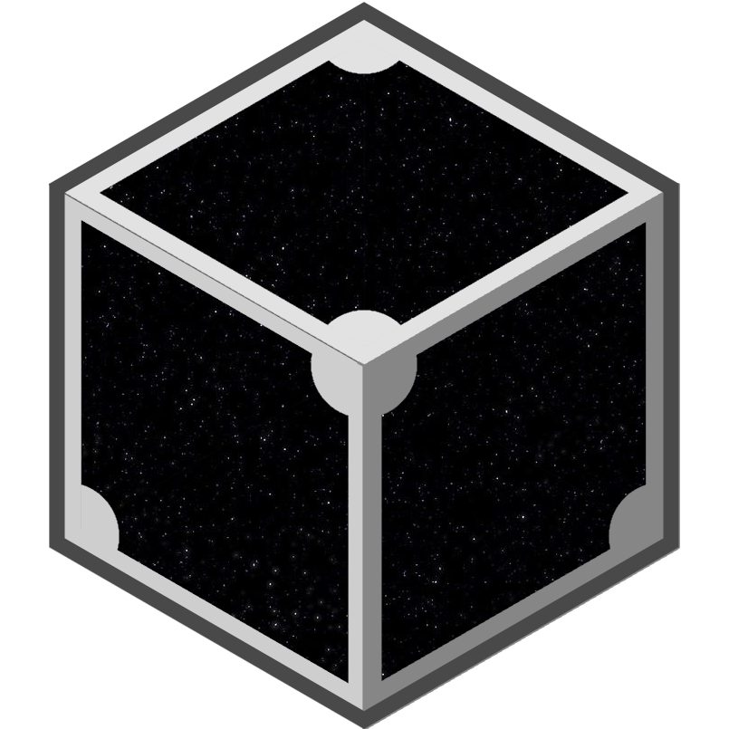

<center>
    <p style="font-size: xx-large">SPACETIME METAVERSE</p>
    
    <p style="font-size: x-large">Whitepaper</p>
    <p style="font-size: large"><a>spacetimemeta.io</a></p>
</center>
<br><br>

**This document was made by [LiquidBlocks](https://twitter.com/FrdricCt15)**

---

It consist of 7 distinct sections describing key elements of Space time meta 
The document is meant to be the whitepaper describing our project while providing high level development guidelines for those wishing to contribute  to the  space time meta project.

A video version of this document is available [here](https://www.youtube.com/watch?v=UupAyGZQdO4)

## Part 1. What is a Metaverse? 
According to Wikipedia, A metaverse is a persistent online virtual environment that incorporates a broad range of Internet functions. In futurism, the term is often described as a hypothetical iteration of the Internet as a virtual world that is facilitated by the use of virtual and augmented reality headsets.

In other words, picture the internet but instead of web pages, you would have a collection of Virtual Reality Environments connected together in order to simulate one complete virtual world.

## Part 2. What is the portal?
In video game development, everything starts with a scene. In that scene you have cameras and objects in order to create virtual spaces. These spaces can be any size, contain any custom 3D objects or other game assets, but they are restricted to the limitations of the device running them. A more powerful and faster computer could simulate bigger and more complex scenes. When thinking about Metaverses, like in the movie Ready Player One, a naive approach is to imagine the world as one giant scene containing the whole Metaverse. But that way of implementing the Metaverse would be very complex and would require an enormous amount of computing power to run it.

A better implementation strategy is to break the world into multiple scenes and connect them in a way that is hidden to the user. 

For example, Let’s take a simple Metaverse containing only the earth and the moon. To simulate this environment we would need a minimum of 3 scenes. One for the planet earth, one for the moon and finally an empty scene to simulate the empty space between the earth and the moon. If a user wants to fly all the way from earth to the moon, he would start on the earth scene. Then upon reaching the interplanetary space, the empty scene would take over and simulate the voyage until the user reaches the moon. Then the scene would switch again to become the simulation of the moon. If the transition between scenes is perfect, the user will have the impression that the Metaverse is a single scene. 

Now instead of the earth, moon and space, imagine the same thing but with your personal virtual space, a museum, a game or any other custom scene. Add the appropriate portal scene and we can connect any VR application to any other VR application. That way, we can make the internet appear like one giant universe.

## Part 3. Implementation of the portal.
In  Space time meta, we will implement teleportation, interplanetary travel and other custom ways of moving around the metaverse. But, for now, the only way to move around is by going to the portal scene where the Metaverse can be seen at its smallest scale. Select a location and then enter it by following a link. In future implementations, we will also navigate by following links but the transition between pages will be hidden to the user.

To provide a seamless experience to the user, we will modify the browser and implement a protocol that creates a perfect transition between a custom VR environment and the portal scene. 

This transition will work the following way. When the user in a virtual environment enters the portal, the browser will start loading the portal scene in a new browser tab. Once the portal scene is loaded, both web pages will start displaying the transition animation while talking to each other in order to synchronize their display. Once both pages are in sync, the browser will change tabs and the portal scene will take over creating a perfect transition that is hidden to the user.

To achieve this effect and create a perfect transition is not that difficult. The difficult part in such a protocol is to have all the VR environment creators agree on the implementation of this said transition. For this reason we need to create a standard and unify the way VR environments are built. Fortunately, most of the job has already been done.

## Part 4. Protocol Standards.
Since the Metaverse is simply a new iteration of the internet, we don't have to reinvent the wheel. There is already a broad range of standards and protocols for creating compatibility and interoperability between web pages. If we want the same type of compatibility and interoperability in the metaverse, all we have to do is follow these protocols to create new metaverse relative standards. 

As you will see later, part of the minting funds are reserved to stimulate the creation of these standards. The goal is to create a metaverse where everyone can create Virtual Reality Environments and connect them to the metaverse as easily as we create and publish web pages today.

## Part 5. Cardano Storage.
In Space time meta, the space is divided into cubic chunks of one unit each. Each chunk is a uniquely identified Cardano Non-Fungible Token (CNFT) that can be owned and traded by the users. The Space Chunk CNFTs are immutable and will forever live on the Cardano Blockchain. 

There is virtually an unlimited amount of space chunks.

On top of these Space Chunk CNFTs, we build the metaverse using transaction metadata. Users can link metadata to their chunks by attaching a json to a transaction. Upon processing the transactions, the Cardano Blockchain stores the information in a secure, decentralized, verifiable and immutable way. Using this storage method, users can link their chunk to a virtual environment of their choice, adding their custom scenes to the Metaverse.

## Part 5.1. Metadata tags
All the spacetime related information can be found in tags prefixed by `77223`.

**Tag 001: chunk customization**

`77223001` is the tag for chunk customization. The standard format is the following:
```
{
  "77223001": {
    chunks: [<chunkName>]
    name: <string>,
    logo: <url>,
    image: <url>,
    portal: <url>,
    planet: <url>
  }
}
```
Except for the `chunks` field, all the other fields are optionals. Field that are not customized will be set to the default values. The default values are stored in a GitHub repo and can be modified. Any one can propose a modification by creating a pull request to this [json file](https://github.com/Spacetime-Meta/spacetime-metadata/blob/main/defaultChunk.json) 

**Tag 002: Proposal vote**

`77223002` is the tag for [Spacetime Governance](https://www.spacetimemeta.io/#/governance) votes. The standard format is the following:
```
{
    "77223002":
        chunks: [<chunkName>],
        option: <customOption>,
        proposalID: <proposalID>
    }
}
```
All the fields are mandatory for this one. The option can be any string or number. The proposal ID must match an proposal that is open at the time of the transaction.

**Tag 003: Profile Customization**

`77223003` is the tag for [Spacetime profiles](https://www.spacetimemeta.io/#/profile). A complete [identity whitepaper](./identity_whitepaper.md) is available on the subject.

## Part 5.2. Space Chunk 0.
Space Chunk 0 is the center of the Metaverse and points to the root scene of the simulation. It contains a scene that represents the universe at its smallest scale. This is the scene displayed to users about to navigate the Metaverse. We call it the map or the portal scene.

At any time, you can find the first version of the Metaverse by querying the first transaction including Space Chunk 0 and looking for specific tags. There you will find a hash of the first version of the Portal Scene and a hash of the first version of spawn planet. These hashs are IPFS CIDs allowing access to the metaverse via any IPFS gateway. This strategy will allow the Metaverse to be fully independent and run only on decentralized storage systems, meaning no company or individual is responsible for hosting the Metaverse.

## Part 6. How do we connect the metaverse to the blockchain?
The answer is, we do not connect the metaverse directly with the blockchain. Instead we provide everyone with their own backend process to connect and run a database on their local machine. This database will be in sync with the blockchains and will provide data to the metaverse. There are 4 benefits to this approach:.

## Part 6.1. Avoiding API fees.
If we were to connect the Metaverse with the blockchain in real time, it would require a massive amount of API calls every time someone loads into the metaverse. Running databases, servers and distributing the data would quickly become expensive. Since we want the metaverse to remain completely decentralized, fees must be the user's own responsibility. That is the reason why people must have the option to choose a provider or provide the data for themselves without any external help.

## Part 6.2. Safety.
If we had connected the metaverse directly with the blockchain, there would be no time to filter out things we don't want in the metaverse. Like hateful content or the injection of malicious code. If a company or individual was in charge of the backend, that person would then be able to choose what they filter out of the metaverse and that could lead to some unwanted censorship. Or on the other end, it would allow that individual, or company, to inject content that should not be in the metaverse like paid marketing or monitoring systems. We want the users to be autonomous in the management of the content that is displayed to them.

## Part 6.3. Interchain operability.
Since the Space chunks are simply pointers to the metaverse assets, they can point to storage sources like IPFS or a classic database server. But they can also point to other blockchains. It would be extremely complex and slow to query all the blockchains and storage systems at the same time. To reduce stress on the system, we engineered Space time meta so that this process is distributed and all the requests and database readings are done over a longer period of time. The result is a condensed, verifiable, easy-to-read and easily accessible database which contains the state of the metaverse. This local database remains the sole property and responsibility of the user.

## Part 6.4. NFT values.
Typically on the web, there is no validation of properties. For instance, on most social platforms, anyone can take a screenshot of a valuable NFT and use it as his profile picture. On Facebook and Discord for example, even if I don't own any Crypto Punks, no one will stop me from having one as my profile picture. That is because no one makes the verification and other users accept to see me this way.  On Space Time meta, we want NFT avatars and other assets to have a real value. This is why it is important that we agree to not display cheaters. 

Since Space Time meta is fully decentralized, no one can stop a user from pointing his chunk to some information he does not possess. However, since the system is not connected directly to the Blockchain storage, we have the possibility to filter its content  in the backend process. This provides the community with the possibility, and the responsibility, to only display content that is legitimately owned by the user. People will still be able to create hacked clients. But we don't really care about the way people see themselves on their local devices. We only care about the way people are displayed to the world and it is important we respect intellectual properties to give real value to our NFTs. Otherwise avatars in the metaverse will have no value, the same way profile pictures have no value today.

## Part 7. Development roadmap.
The roadmap is not sequential. Its goal is to identify the  main development branches for developing a complete metaverse. As the development of space time meta progresses, additional objectives will be added. 

All along, our goal is to support users and creators in their transition to VR headset as the main input device for navigation of the metaverse.

We currently identify the following 3 branches on our development roadmap. 

## Part 7.1. Multiplayer.
We want users to be able to see their friends when they meet in the metaverse. We believe games and VR experiences are meant to be shared, that is why multiplayer is our main priority. It will be implemented via peer 2 peer connections.

## Part 7.2. Avatars and Custom NFT.
We will implement avatars and custom NFT assets. For this part, we will implement the protocols described in part 4.

## Part 7.3. Portal Synchronization.
We will connect VR environments together by implementing the protocol described in part 3. 

## Conclusion.
Thank you for your interest in the space time metaverse. Find us on Discord and join the community to learn more and get the latest updates about deployment of the project.
